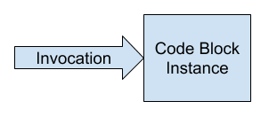
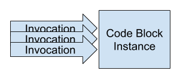
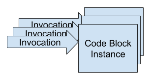

# Architecture & Security

!!! info
	This information is generally only for more advanced users who are curious to understand more about how Refinery works under the hood.
	
## Refinery Managed Hosting Account Isolation

Customers using Refinery's Managed Hosting are allocated their own AWS account behind the scenes. All customer deployments are deployed to the specific AWS account allocated for them when they signed up for the service. At the end of the billing month we pull the total bills incurred to the AWS accounts, add our markup, and charge our customers appropriately.

The core reason why the service is designed this way is for security and for service stability. When a customer deploys their service, they have strong confidence that they are sandboxed from all other customers executing code. Since AWS account isolation is extremely strong, they can rest easy knowing their service is protected from other Refinery customers. The same is true of service stability, one Refinery customer cannot cause an outage of another customer's service by using a large number of resources.

## Understanding Refinery Automatic Scaling

One of the big advantages of using Refinery is that your microservices will automatically scale up to meet large increases in demand. But how does this magic work behind the scenes?

We'll explain this visually, starting with the simple case of one invocation of a `Code Block`.

In this case, assuming the `Code Block` is not ["warm"](/blocks/#warm-cold-executions) a new virtual machine (you can think of this as a whole virtual server) is spun up to execute the code. If another invocation comes in **after** the first invocation has finished - the process will be the same.

However, the real magic comes when multiple invocations are received **simultaneously**.

In the above image we have an example with three invocations happening at exactly the same time. What happens in this situation?

The answer is that three separate virtual machines are spun up. These are completely isolated from each other so all of the code memory, files, and resources are separate. This is how Refinery (built on AWS Lambda) achieves extreme-scalability.

That's not all of the magic! Once a new virtual machine is spun up and has executed a given `Code Block`, the machine is then "frozen" and left "loaded" in memory for a varying period of time. When a `Code Block` is still loaded in memory, it is considered "warm". For developers this means that future executions of already-warm virtual machines will be an order of magnitude faster. This is because it saves the step of doing the regular virtual machine setup which occurs when a `Code Block` first runs.

You can think of "warm" `Code Blocks` as servers which are already running and waiting for more work. Unlike with traditional idling servers though, you don't pay for the idling! You just get this functionality for free. After some time of idling, the virtual machines will automatically be cleaned up and your script will take slightly longer to execute again. This is known as a "cold" execution. The amount of time that a `Code Block` is warm for can vary, but is generally on the order of a few minutes.

!!! info
	With this architecture, it's useful to think of it in terms of parallel invocations. You will only see a slight slowdown when you increase the number of parallel invocations. That is to say, you have more things executing at the same time. If you just have executions happening one after another you will continue stay "warm" and you'll see no slowdown.

## Code Block Isolation

Refinery's `Code Blocks` are deployed as [AWS Lambdas](https://aws.amazon.com/lambda/) under the hood. The isolation of the code executed by `Code Blocks` is roughly the same as AWS Lambda itself. AWS Lambda makes use of the [Firecracker micro-VM framework](https://firecracker-microvm.github.io) to achieve per-Lambda isolation on the underlying servers which host the executions. This means that if one of the `Code Blocks` was compromised to execute malicious code it would only be able to affect its own execution environment. So if you have a service with three `Code Blocks` connected together and the first `Code Block` was compromised it would not be able to read files or otherwise affect the other `Code Blocks` in the service (with some exceptions).