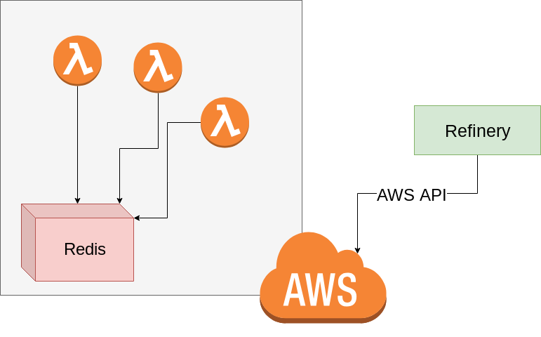

# Architecture

Refinery's base-architecture is fairly simple. The only "real" additional infrastructure which is added to your environment is a single redis instance (or cluster) which is a core part of how Refinery achieves things like [idempotency](https://cloudonaut.io/your-lambda-function-might-execute-twice-deal-with-it/) (ensuring your Lambdas execute only once), message passing, and other core work.

## Why redis?

Redis is an extremely fast datastore which allows for quick retrieval, storage, and atomic data operations. While adding redis does make the infrastructure less "serverless" it's currently required to perform many of Refinery's features. Since redis is so fast it's likely not going to be a choke point for your deployments. However, if you have extremely high loads then you can also make use of an array of redis instances (simply contact us for more information) for extreme throughput. It is possible that in the future there will be enough concrete serverless functionality in AWS to remove the need for redis, but in the mean time we don't want to be contrained by it.

## Refinery Diagram

The above diagram demonstrates the general layout of deployed Refinery projects in your infrastructure.

All of your deployed Lambdas will use redis as a way to perform transitions and to perform other core functionality.