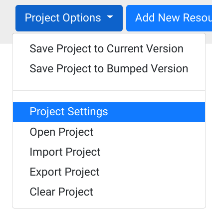
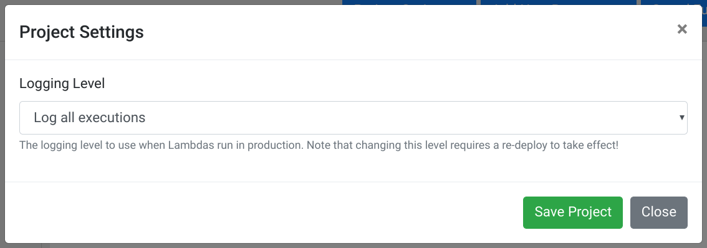
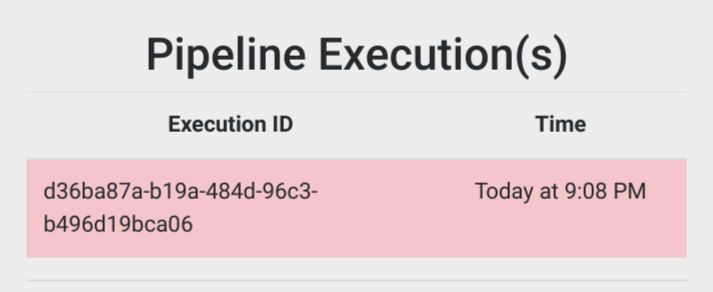
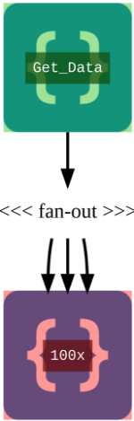
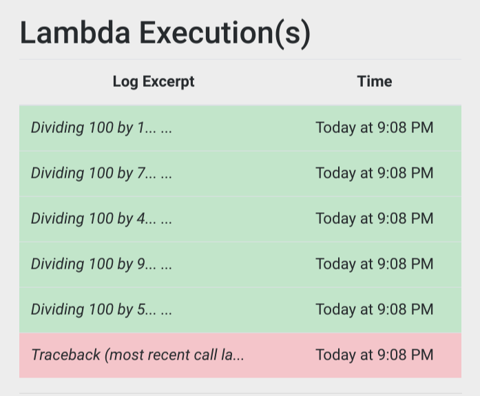
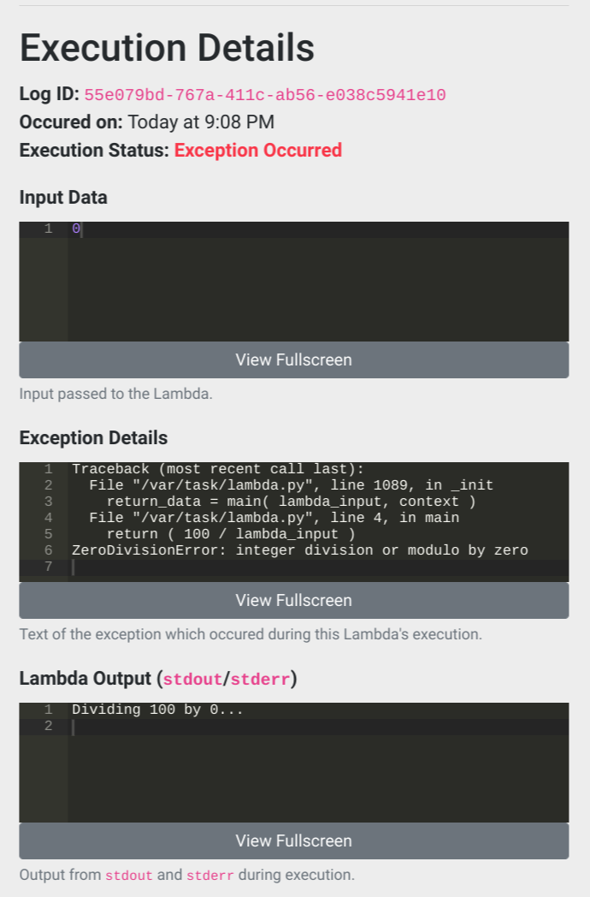
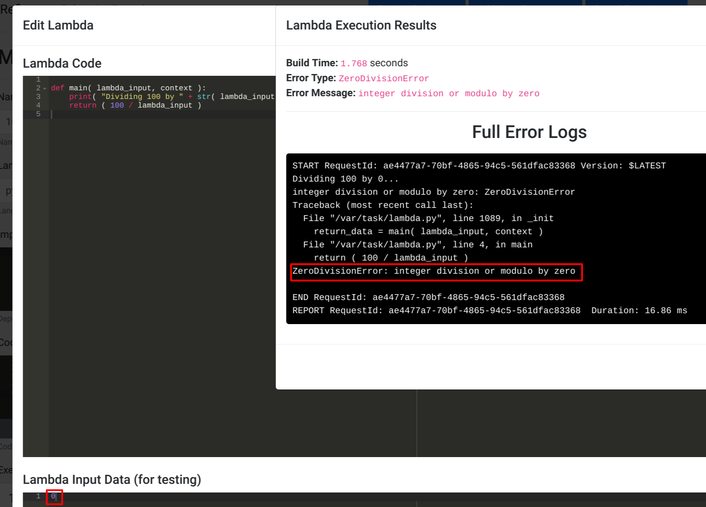

# Debugging & Logging

Debugging in serverless environments can often be a complex chore which feels like working with a [black box](https://en.wikipedia.org/wiki/Black_box). Refinery attempts to greately simplify the debugging process through the use of its scalable logging system built on top of S3. The logging system in Refinery is configurable and allows for extreme verbosity when needed to help pinpoint and easily reproduce problems.

## What Refinery Logs

Before we dive into debugging your service, we first have to talk about logging. Refinery logs a large amount of metadata about a Lambda's given execution. For example, some of the data which is logged is the following:

* The full input to the Lambda.
* The full returned output of the Lambda.
* All `stdout` and `stderr` outputted during execution.
* Time of execution.

The reason for this level of verbosity is to allow easy reproduction of issues. Since development in Refinery is accomplished by building small functional blocks in a pipeline fashion, logging the full input and output allows developers to easy replay the same inputs into the same blocks in the IDE in order to replicate the issue.

## Configuring Your Logging Level

Refinery allows for configuring different levels of logging for when your service is deployed in production. The levels of logging available are:

* `Log all executions`: Every time a Lambda is executed a log file is written.
* `Log only errors`: A log file is written only when a Lambda encounters an uncaught exception.
* `No logging`: No logs are written under any circumstance.

The major tradeoff with logging all executions, error only logging, and no logging is cost. The Lambdas that Refinery deploys make use of S3 for storing of all of the created log objects. This means that you will incur the appropriate level of cost for each write you do to S3. As of the time of this writing, saving an object to S3 is billed at [$0.005 per 1,000 requests](https://aws.amazon.com/s3/pricing/#S3_Standard). While this may seem inexpensive, it can add up if you're doing full verbosity logging on pipelines with a large number of executions. It's important to always be mindful about the amount of resources you're consuming when using Refinery.

In order to configure your logging level for a given project, select `Project Settings` under the `Project Options` menu:

<center>

</center>

The following dialogue will be presented which allows for changing the logging level:

<center>

</center>

!!! note
	Changes in the logging level require a re-deploy to take effect.
	
## Viewing Logs of a Deployed Project

After deploying a project with the logging level set to `Log all executions` or `Log only errors` you can then review the logs by clicking on `View Production Deployment` followed by clicking `View Log(s)`.

<center>

</center>

The above screenshot demonstrates an example execution log group. In Refinery, logging is grouped by unique triggers of the deployed pipeline. What this means is that anytime a trigger (such as a [Schedule Trigger](/nodes/#schedule-trigger), or an [API Endpoint](/nodes/#api-endpoint)) starts a pipeline's execution, a new execution ID will be generated. Multiple Lambda executions can be contained under a single pipeline execution ID.

In the above screenshot you can see that the pipeline execution group is colored red. This is because somewhere in this pipeline's execution an uncaught exception occured. In Refinery if even a single Lambda in a pipeline's execution results in an uncaught exception being thrown the entire pipeline execution will be marked red. This is to ensure that errors do not go unmissed and to provide a clear distinction between a pipeline which executed completely without errors and a pipline which experienced no issues.

Click on the pipeline execution box to view details about it. You'll see that upon viewing a specific pipeline execution that your deployment will have green and red boxes drawn over each Lambda:

<center>

</center>

This works in a very similar way to how coloring works for the pipeline execution log groups. If a Lambda is executed three times and one of the executions results in an uncaught exception the box will be red. If none of the executions of a given Lambda resulted in an uncaught exception the box with be green. If the Lambda was never executed in that pipeline execution it will not be colored.

To view more information about a Lambda's execution(s), simply click on the Lambda itself. In this case we'll view the `100x` Lambda's executions to understand what caused the uncaught exception. Upon clicking on the Lambda we get the following:

<center>

</center>

The above screenshot shows that the Lambda executed successfully five times and encountered an uncaught exception once. Since we want to understand what caused this exception we'll click on the red line to get more information about that specific execution:

<center>

</center>

The above screenshot shows the details of the execution. We can see that the input to the Lambda was the integer `0` and the stack trace was the following:

```python
Traceback (most recent call last):
  File "/var/task/lambda.py", line 1089, in _init
    return_data = main( lambda_input, context )
  File "/var/task/lambda.py", line 4, in main
    return ( 100 / lambda_input )
ZeroDivisionError: integer division or modulo by zero
```

The code, which you can probably infer from the stack trace, was the following:

```python
def main( lambda_input, context ):
    print( "Dividing 100 by " + str( lambda_input ) + "..." )
    return ( 100 / lambda_input )
```

We can clearly see that the cause of this problem was the input to the Lambda being `0` which we divided the number `100` by. This caused an uncaught `ZeroDivisionError` exception which was logged by Refinery as a failure. While this particular issue was easy to spot, in more complex scenarios it may be harder to find the root cause of an error. In these situations you can better debug the problem by copying the input under the `Input Data` section and running it through the Lambda in the IDE. The following screenshot demonstrates this process:



The above screenshot shows our simplistic example of passing in the `0` as input to this particular Lambda in the IDE. We get the same exception as we did in production and we can easily modify the code here to find the root cause without touching the production deployment. Once we have a fix we can simply deploy it to production to remediate the problem.