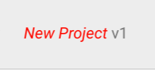
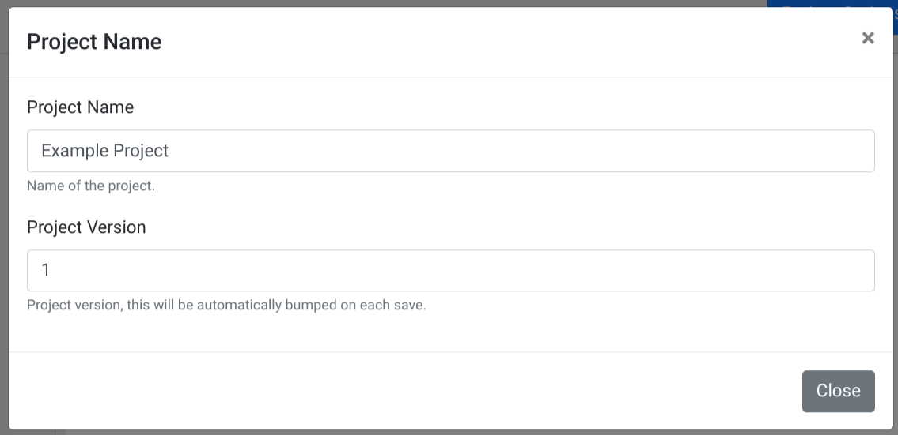
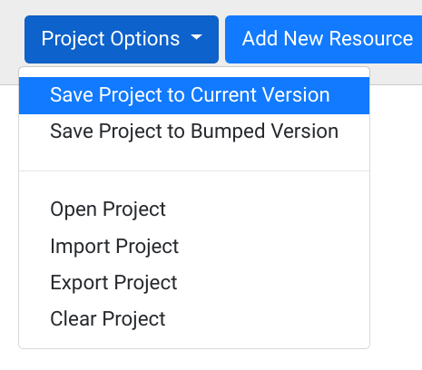
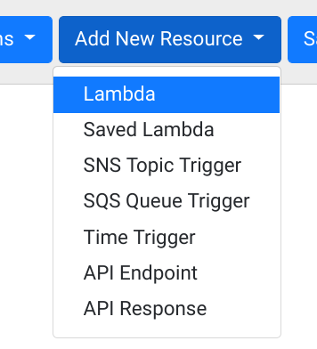
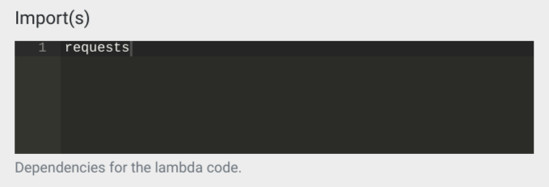
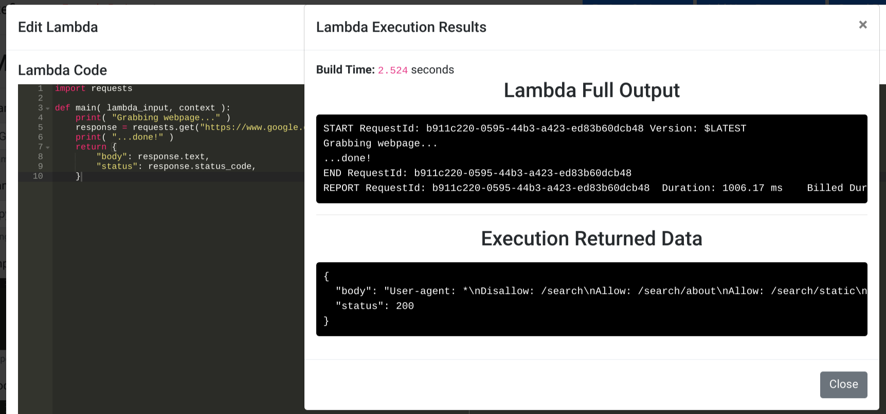
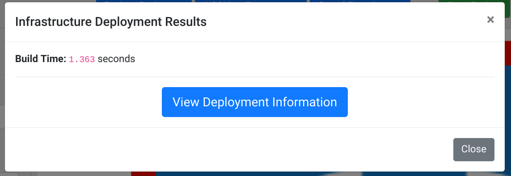
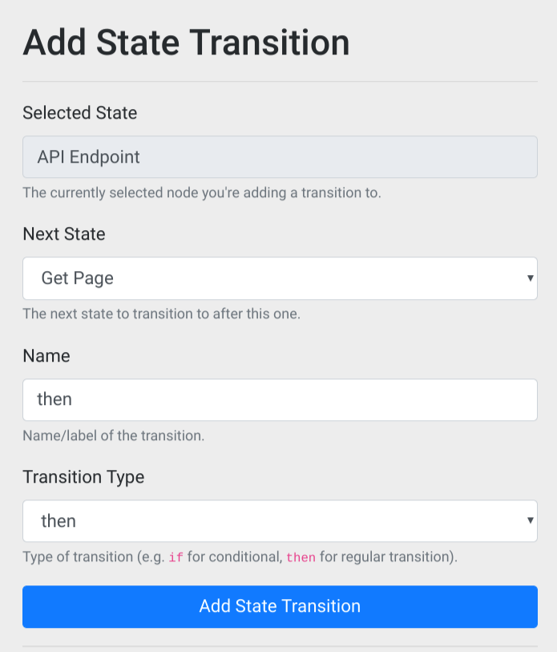
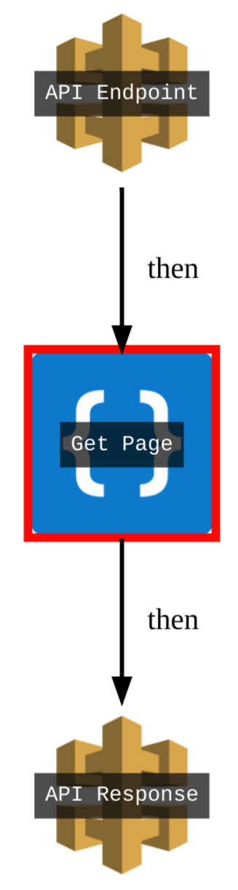

# Getting Started

This intro will walk you through creating a new Refinery project and deploying it to production.

## Creating a Project

First navigate to your version of Refinery. You will be greeted with an empty canvas along with a greeting of `Welcome to Refinery!`.

In the top-left corner you'll see the text `New Project`. This is the default name of a project in Refinery. Click on this red text to change the name of your current project:

<center>

</center>

Upon clicking this text you'll see the follow dialogue:

<center>

</center>

Here you can change your project's name to whatever you'd prefer. The only restriction is that project names must be unique and Refinery won't let you use a name which is in use for another project. For this demo, just set the name to `Example Project` (or whatever you'd prefer). Keep the version at `1` and click the `Close` button to close the dialogue.

## Saving the Project

To save the project, click on the `Project Options` button and select `Save Project to Current Version`:

<center>

</center>

Once you've done this you've now created your first (empty) project! You'll notice that the `Save Project` and `Deploy to Production` buttons have now appeared in the top-right corner of the page. These are for easy access to these actions while you develop your serverless applications.

!!! warning
	It's important to ensure that you always save your progress. If you leave the page without saving your project you can loss all of the changes you've made. Nothing is more frusterating than lost work so ensure that you save your progress often. Additionally, if you make changes you wish you hadn't you can just refresh the page and re-open your project without saving to revert your change(s).
	
## Adding your first Lambda

An empty project isn't useful for much, let's add something to the canvas! Start by clicking on the `Add New Resource` dropdown menu and selecting `Lambda`:

<center>

</center>

This will add a Lambda named `New Lambda` to your canvas. Click on the Lambda icon to get options for editing it.

You can now see some of the options you have for editing the Lambda. We'll start by renaming it to something new. In the `Name` field change `New Lambda` to `Get Page` and then scroll down the menu to the `Update Lambda` button. Click the button to save the new name to the Lambda. It's important to note that saving the Lambda does **not** save the project, these are explicitly different things. You will need to make sure to save the changes to the nodes you're working on as well as saving the entire project when you want to persist the changes.

Now we will add the "meat" to our Lambda. We're going to make this Lambda grab a webpage and print the results. We'll start by adding the Python `requests` library to our `Import(s)` for our Lambda. Just add the text `requests` to the `Import(s)` text box similar to what is shown in the following screenshot:

<center>

</center>

The items listed under `Import(s)` refer to Python `pip` packages. You can do just the regular package name such as `requests` or you can do a specific version like `requests==2.21.0`. For the Python 2.7 language, any valid syntax for `pip` requirements files will work here. For more information on the format see [the `pip` documentation](https://pip.pypa.io/en/stable/user_guide/#requirements-files).

Now we'll add code to our Lambda, since it's hard to code in a tiny screen click the `View Fullscreen` button under the `Code` section of the Lambda menu. The following is the example code we'll be adding:

```python
import requests

def main( lambda_input, context ):
    print( "Grabbing webpage..." )
    response = requests.get("https://www.google.com/robots.txt")
    print( "...done!" )
    return {
        "html": response.text,
        "status": response.status_code,
    }
```

Feel free to just paste the above code in. Now, in the fullscreen editor click the `Run Lambda` button to try running the code. Once you do you'll see the following:

<center>

</center>

Here we can see the full Lambda output, (ignore the `START`, `END`, and `REPORT` lines for now, as these are part of Lambda's internals). We can see the lines that we've printed along with the JSON that we returned. This brings us to an important point which is that in Refinery you always need to return data in a JSON-serializable format. This means that you can return things like strings, integers, and arrays, but full "complex" objects cannot be returned.

Now that we've added some code let's save our progress by clicking the `Save Lambda & Project` button. This will both save our changes to the Lambda and save our entire project. Now we can close our fullscreen editor by clicking outside of the box, or by clicking the `Close` button.

## Deploying the project

We'll now actually deploy our project to production. Unlike with many conventional build systems, building and deploying to production doesn't take very long in Refinery.

!!! note
	Refinery makes heavy use of dependency caching. The first time you add or change the `Import(s)` that you Lambda uses you will notice that deploying and running your Lambdas will take slightly longer. This is because Refinery builds Lambda "templates" out of these libraries and then injects your code into the cached templates during deployment/running. Once the cache has been built all future runs and deploys will take seconds. So entire deploys may take a minute or two the first time, but the second time they will take only a few seconds.
	
Click the `Deploy to Production` button in the top right corner of the page to deploy your project. This should only take a few seconds, afterwards you'll be presented with the following:



Click on the `View Deployment Information` button, this will take you to the Deployment Viewer. The deployment viewer allows you to see your deployed project's state and allows you to do things like view logs, debug pipelines, and see your deployment in the AWS console. Click on the Lambda you just created to see more information about it, as well as the options you can do with it.

For now we're just going to run this Lambda while it's deployed. Click on the `Run Lambda` button to get a screen similar to the previous code editor. This is mostly the same, but you're not able to edit the code since it's currently deployed. Click `Run Lambda` to again run our created Lambda, you'll see the very familiar screen showing the output and the return value of the Lambda.

Of course, just creating single Lambdas without any chaining doesn't show off Refinery's real power which lies in it's transitions and triggers. To show some of this off we're going to make this an API endpoint without writing any additional code!

## Painless API Endpoints

Click the `Tear Down Deployment` button to tear down our deployed project and bring us back to the regular editor.

!!! note
	Tearing down deployments in Refinery is always a very fast operation. Unlike conventional build systems and production infrastructure, there's no servers to turn down or terminate so deleting things is easy.
	
Under the `Add New Resources` dropdown menu, select `API Endpoint`. Do so again, this time selecting `API Response` to add an `API Response` node to the canvas.

We now have a bunch of nodes which we can link together. Click on the `API Endpoint` node and click the `Add Transition` button. You will now see a menu similar to the following:

<center>

</center>

These default options are fine, we're adding a transition from the `API Endpoint` to the Lambda we created. Click the `Add State Transition` button to add this transition. Now, click on the `Get Page` Lambda node, and select `Add Transition` once again and under `Next State`, select `API Response` and click `Add State Transition`.

You should now have a pipeline similar to the following:

<center>

</center>

We've now done all we need to do to make this Lambda an API endpoint! Click the `Deploy to Production` button to deploy it. Now click `View Deployment Information` to see the newly-deployed project.

To view your newly created `API Endpoint`, click the `API Endpoint` node and select the `Deployed Endpoint URL`. This link will open a new tab with your API Endpoint URL and the returned JSON response is simply what was returned from the Lambda:

```json
{"status": 200, "html": "User-agent: *\nDisallow: /search\nAllow: ...trimmed for brevity...
```

## Going Forward

You've now made a simple project in Refinery, check out other parts of this documentation to create more complex pipelines!