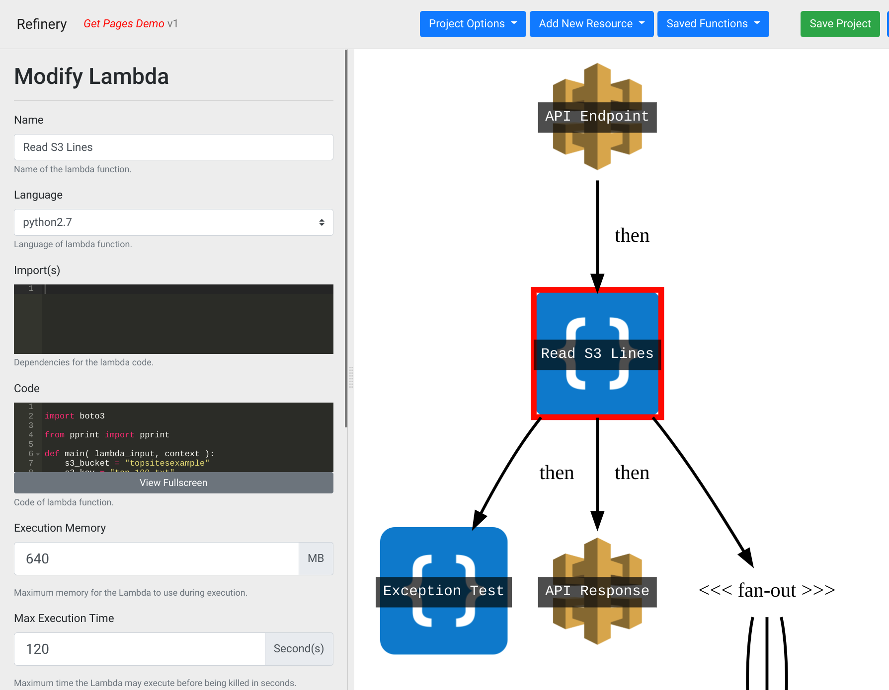

# What is Refinery?

Refinery is a visual IDE which allows you to build serverless services without having to deal with all of the normal complexity involved. Refinery instead opts for a more intuitive approach to development by allowing developers to build small functional programs which are linked together in a visual designer to build infinitely scalable applications. By using this approach, developers can immediately start building scalable services without any of the conventional system operations, distributed computing, and computer science knowledge.

Example screenshot of a Refinery project
